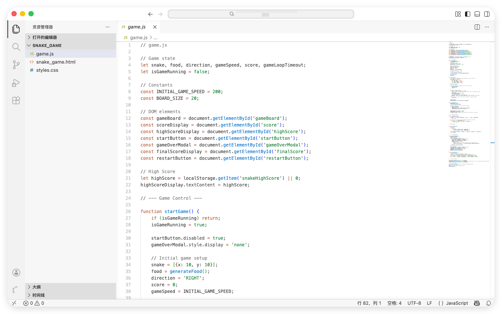
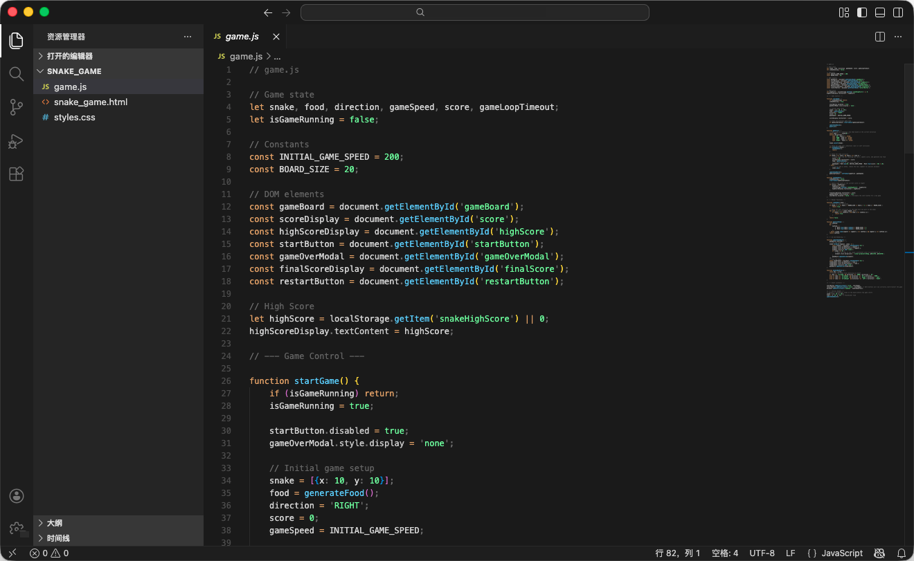
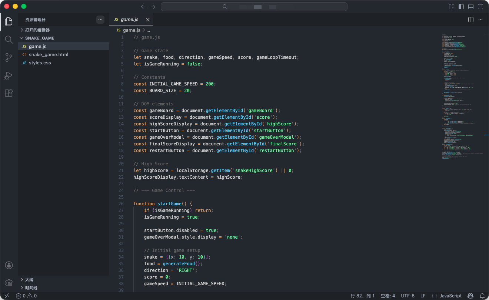

  

    English
    ·
    <a href="https://github.com/septwong/vscode-focus-theme/blob/main/README_zh-cn.md">简体中文</a>

# Focus Theme

A VS Code theme designed for focus.

Highlight only what truly matters:
- Strings and constants
- Top-level definitions
- Meaningful comments

Less visual noise. More clarity. Faster navigation.

## Preview

  <em>Light</em>
   
  

  <em>Dark</em>
   
  

  <em>Darker</em>
   
  

## Usage

After installation, open VS Code:
> Color Theme → Select **Focus Theme**

Feedback is welcome!