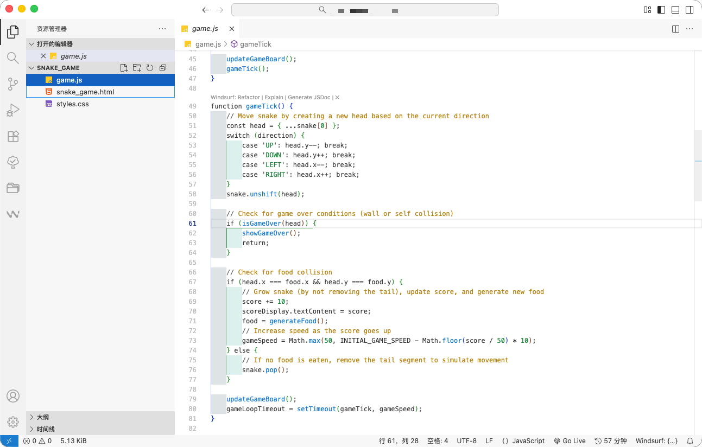
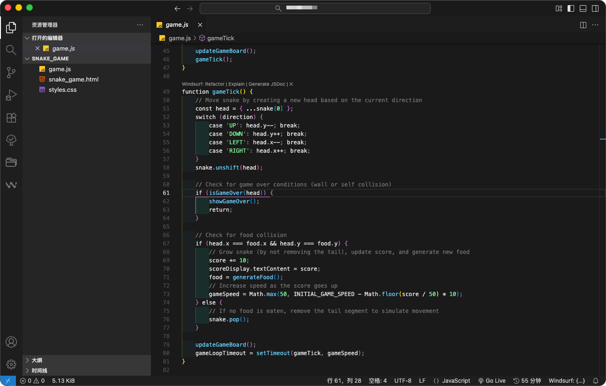

  

    简体中文
    ·
    <a href="https://github.com/septwong/markdown-syntax/blob/main/README_en.md">English</a>

# Focus Theme | 焦点主题

一个强调「专注」的 VS Code 主题。

使用最少的颜色，突出代码中真正重要的信息：
- 字符串与常量
- 顶层定义
- 有意义的注释

减少视觉干扰，让阅读与定位更高效。
支持浅色与深色两种风格。

## 主题预览

  

  

## 使用方式

安装扩展后，打开 VS Code：
> 主题设置 → 选择 **Focus Theme**

欢迎反馈和建议！